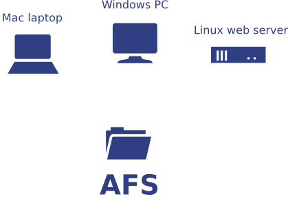
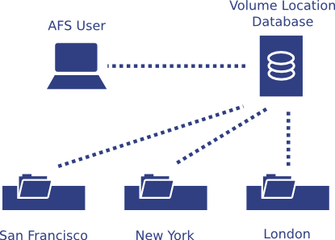

AFS is a distributed filesystem that enables computers to efficiently share filesystem resources across both local area and wide area networks.

### Cross-platform ###

AFS clients are available for Windows, Mac, Linux, and others. All the clients access files through a single, global namespace: "/afs".

### Single sign-on ###

AFS fits with existing Kerberos setups, including MIT Kerberos, Heimdal, and Microsoft Active Directory. This allows you to use single sign-on to securely access AFS.

### Location independence ###

AFS Clients talk to metadata servers to find content on AFS fileservers. Administrators can move content from one server to another and all clients pick up the changes transparently. You can also serve multiple read-only copies of the data simultaneously for high availability.

## History ##

AFS is based on a distributed file system originally developed at the Information Technology Center at Carnegie-Mellon University that was called the "Andrew File System".

"Andrew" was the name of the research project at CMU - honouring the founders of the University. A spin-off company, Transarc Corporation (now part of IBM), started producing and marketing a commercial version of AFS in 1989.

In November, 2000, IBM Open-Sourced AFS, creating OpenAFS. Development continues to this day.

Read more at the [General FAQ](http://wiki.openafs.org/GeneralFAQ/).
