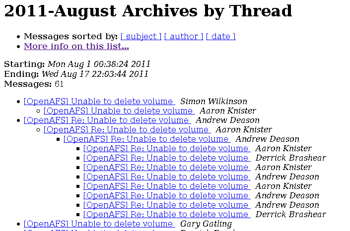
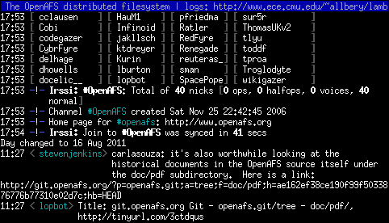
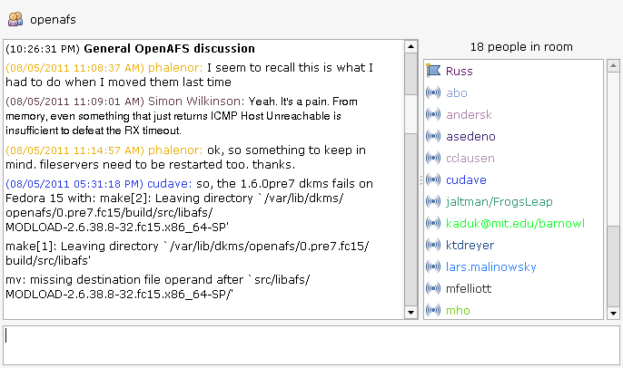

## OpenAFS Community ##

OpenAFS has several locations for its online community.

### Mailing Lists ###

Don't miss announcements on the low-traffic openafs-announce email list. If you need help with AFS, join the openafs-info email list and post your question.

### IRC (Internet Relay Chat) ###

If you're into IRC, you can find several users in #openafs on irc.freenode.net.

### XMPP Conference Chat ###

Several AFS developers hang out in the openafs Jabber (XMPP) conference room online. Please take end-user questions to IRC, and discuss OpenAFS development in Jabber.

### AFS & Kerberos Best Practices Workshop ###

The best way to get training, meet other AFS users face-to-face, hear cool presentations, and get the scoop on the future directions of OpenAFS.

### European AFS & Kerberos Conference ###

Same deal as the AFS & Kerberos Best Practices Workshop, but across the pond.

### Newsletter ###

Read a summary of [what's happening in the OpenAFS community](XXXbrokenlink).

### Success Stories ###

Read about [experiences with AFS](XXXbrokenlink).

### Follow Us ###

Connect with us on [Facebook](https://www.facebook.com/group.php?gid=23943836912) and [Twitter](https://twitter.com/openafs).
